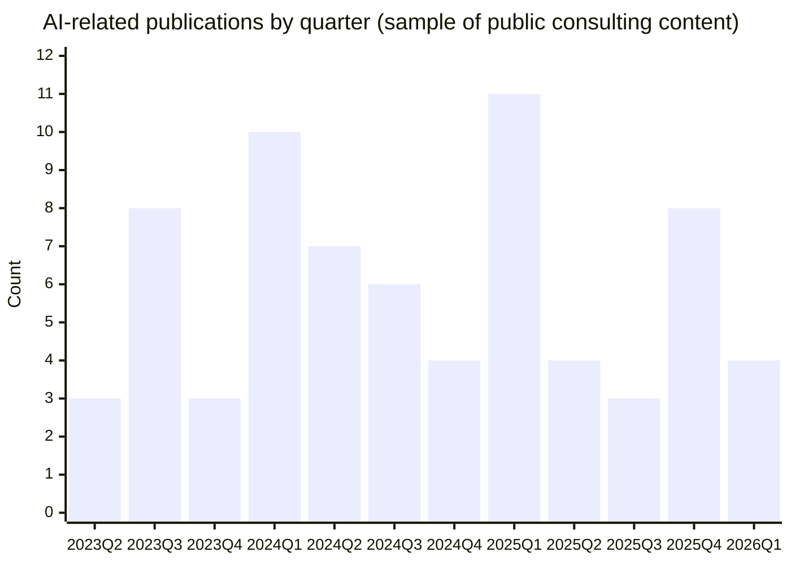

# AI Publications from Top Consulting Firms

## Executive Summary

This report compiles a **public-link index** of English-language, AI-related publications from major consulting firms within the requested rolling window **March 6, 2023 to March 6, 2026** (America/Mexico_City). It covers AI, machine learning, generative AI, automation, data strategy, AI ethics, and AI governance—with additional sector-focused pieces (for example: pharma, financial services, telecom, retail, public sector).

The attached dataset is a **curated seed index (78 unique URLs)** drawn from official firm domains and “insights/publications/newsroom” pages, with structured fields (firm, title, URL, date, one-sentence summary, type, tags, and notes). It includes the requested “at minimum” firms plus additional large consultancies (e.g., Accenture, Deloitte, PwC, KPMG, EY, Capgemini). The dataset demonstrates—and links to—high-interest streams such as:
- **Generative AI macro value and work redesign** (e.g., McKinsey’s “economic potential” report; BCG workforce-first framing). citeturn28search2turn29search3  
- **Governance / risk / responsible AI** (e.g., governance roadmaps for scaling gen AI “with speed and safety,” and explicit responsible-AI commitments). citeturn28search1turn30search1  
- **Agentic/agent-based systems** (e.g., “agentic” or “digital agents” framing in customer service, compliance, and enterprise operations). citeturn29search1turn31search4turn32search12  

Important constraint: while several firms publish **far more** eligible items than captured here (for example, McKinsey maintains a hub stating it has published “more than 100” gen AI articles). citeturn28search9  
Because of the breadth (multi-firm, multi-topic) and the practical limits of single-pass online collection within this workflow, this index is **not yet “in the hundreds.”** The final section specifies **which details are unspecified** (where applicable) and how the CSV is structured to support expansion.

## Scope and approach

Inclusion criteria:
- **Publicly accessible** URL on an official firm domain (insights/publications/newsroom/blog/press release/report landing page).
- **English-language** page or English version of a page.
- Topic relevance: AI, ML, generative AI, automation, data/analytics strategy, ethics, governance, sector applications.
- Target window: **2023-03-06 through 2026-03-06**.

Metadata capture:
- **Publication date** is captured when visible on-page in the snippet/header (common for many “publications” pages, press releases, and reports). citeturn29search3turn30search2turn32search10  
- When only **month/year** is clearly inferable (for example from a dated URL path containing `/2025/oct/`), the date is stored as a month-level estimate and flagged via `date_precision` and `notes`. citeturn31search4  
- Where the date was **not visible** in the available snippet, the `publication_date` field is left blank and explicitly flagged in `notes` as requiring page-level verification (these are still included because they are highly relevant, public, and on official domains). citeturn30search9  

Document typing:
- Uses the firm’s own label when present (Article/Report/Press release/Brief/etc.), common on many firm publication pages. citeturn29search11turn30search2turn32search8  

Tagging:
- Tags are normalized (e.g., `generative ai`, `ai governance`, `responsible ai`, `agentic ai`, `automation`, plus sector or function tags).

## What consultancies are publishing about AI

Across firms in this window, a few recurring “consulting-grade” frames appear repeatedly:

Enterprise value realization, not demos  
Several firms are emphasizing that the core challenge is moving from pilots to measurable value, often tying outcomes to process redesign and operating models. BCG’s workforce-centric framing (value largely from people/process change), and McKinsey’s scaling + governance guidance are representative. citeturn29search3turn28search1  

Workforce transformation and role redesign  
Workforce upskilling, work decomposition, and role evolution show up repeatedly, including HR operating-model transformation and executive responsibility for adoption. citeturn29search10turn32search6turn32search10  

Governance, risk, and “responsible AI” operationalization  
Many consultancies are treating governance as a practical operating requirement (steering groups, accountability, data/privacy guardrails), not just a principle. citeturn28search1turn30search1turn32search11  

Agentic AI, digital agents, and orchestration layers  
A visible thread is the shift from chat interfaces to agentic/digital agents that plan and act across workflows (customer service, telecom IT, compliance). citeturn29search1turn31search2turn32search12  

Sector-specific deployment playbooks  
Examples in the index include pharma (gen AI scaling constraints and opportunities), asset management transformation, insurance claims operations, retail store operations, and public-sector adoption. citeturn28search8turn29search11turn31search5turn29search9  

## Data extract of the first 50 entries

The table below shows the **first 50 entries** (sorted by publication date, newest first; items with unknown publication date appear after dated items). URLs are included inline for verification.

| firm         | publication_date   | date_precision   | title                                                                 | document_type      | tags                                                          | url                                                                                                                                                                                                 | summary                                                                                                          |
|:-------------|:-------------------|:-----------------|:----------------------------------------------------------------------|:-------------------|:--------------------------------------------------------------|:----------------------------------------------------------------------------------------------------------------------------------------------------------------------------------------------------|:-----------------------------------------------------------------------------------------------------------------|
| BCG          | 2026-02-04         | day              | AI Transformation Is a Workforce Transformation                       | Article            | ai; future of work; change management; governance; skills     | https://www.bcg.com/publications/2026/ai-transformation-is-a-workforce-transformation                                                                                                                | Argues most AI value is unlocked via workforce upskilling, leadership, operating-model redesign, and adoption … |
| BCG          | 2026-02-02         | day              | The Reinvention of the CHRO in an AI-Driven Enterprise                | Article            | ai; hr; operating model; governance; skills                   | https://www.bcg.com/publications/2026/reinvention-of-the-chro-in-an-ai-driven-enterprise                                                                                                             | Positions HR as central to AI transformation, focusing on work redesign, governance, culture, and trust-build… |
| Oliver Wyman | 2026-02-01         | month            | Agentic AI Transforming Compliance at Financial Institutions          | Article            | agentic ai; compliance; financial services; governance        | https://www.oliverwyman.com/our-expertise/insights/2026/feb/agentic-ai-compliance-reshaping-financial-institutions.html                                                                               | Explains how agentic AI could orchestrate compliance workflows with human oversight, shifting compliance from … |
| BCG          | 2026-01-09         | day              | AI Fuels Field Service Transformation. Change Management Provides the Spark | Article            | ai; operations; change management; field service; productivity | https://www.bcg.com/publications/2026/ai-fuels-field-service-transformation                                                                                                                           | Explains how field service teams can realize AI productivity gains by pairing AI tools with robust change man… |
| BCG          | 2025-12-03         | day              | Agentic AI Is the New Frontier in Customer Service Transformation     | Article            | ai agents; agentic ai; customer service; operating model; change management | https://www.bcg.com/publications/2025/new-frontier-customer-service-transformation                                                                                                                    | Blueprint for using agentic AI to move customer service from reactive cost center to proactive value creator … |
| PwC          | 2025-11-25         | day              | Daily GenAI users see higher pay, job security and productivity – while a third of the global workforce regularly feel overwhelmed | Press release      | generative ai; workforce; survey; productivity                | https://www.pwc.com/bm/en/press-releases/daily-genia-users.html                                                                                                                                     | Press release summarizing survey evidence that daily GenAI users report higher productivity and perceived job… |
| BCG          | 2025-11-04         | day              | Empathy Is Essential in AI Transformations                            | Article            | ai; change management; leadership; future of work             | https://www.bcg.com/publications/2025/empathy-essential-ai-transformations                                                                                                                            | Perspective emphasizing empathy, narrative, and behavioral change as foundations for workforce adoption in AI… |
| KPMG         | 2025-11-01         | month            | Canadians call for clear AI policies as adoption grows (Generative AI Adoption Index 2025) | Press release      | generative ai; workforce; policy; governance; canada          | https://kpmg.com/ca/en/home/media/press-releases/2025/11/canadians-call-for-clear-ai-policies-as-adoption-grows.html                                                                                   | Press release on workplace GenAI adoption trends and the prevalence of employer AI policies, citing the Gener… |
| McKinsey     | 2025-11-01         | month            | McKinsey Explainers: What’s the future of generative AI? An early view in 15 charts (PDF) | PDF                | generative ai; risk; governance; survey; charts               | https://www.mckinsey.com/~/media/mckinsey/featured%20insights/mckinsey%20explainers/whats%20the%20future%20of%20generative%20ai%20an%20early%20view%20in%2015%20charts/whats-the-future-of-generative-ai-an-early-view-in-15-charts.pdf | A PDF explainer that visualizes survey-reported gen AI risks, adoption patterns, and organizational guardrail… |
| BCG          | 2025-10-01         | day              | GenAI Promised a Creative Revolution. Can Marketers Deliver?          | Article            | generative ai; marketing; workflows; skills                   | https://www.bcg.com/publications/2025/genai-promised-revolution-can-marketers-deliver                                                                                                                 | Survey-informed guidance on integrating GenAI into marketing creative workflows, emphasizing upskilling and w… |
| Oliver Wyman | 2025-10-01         | month            | This Is How Generative AI Is Redefining Financial Assessment          | Video/article      | generative ai; credit risk; financial services; unstructured data | https://www.oliverwyman.com/our-expertise/insights/2025/oct/how-generative-ai-redefines-credit-risk-assessment.html                                                                                    | Video/article describing how GenAI can analyze unstructured data to improve corporate credit risk assessment a… |
| Oliver Wyman | 2025-10-01         | month            | Unlocking The Benefits Of AI In Federal Credit Programs               | Article            | ai; public sector; governance; risk management; operations    | https://www.oliverwyman.com/our-expertise/insights/2025/oct/unlocking-ai-federal-credit-program-governance-applications.html                                                                            | Report-oriented article on applying AI across US federal credit programs, highlighting governance and implement… |
| BCG          | 2025-09-30         | day              | The Widening AI Value Gap                                             | Article            | ai; value realization; benchmarking; ai maturity; productivity | https://www.bcg.com/publications/2025/are-you-generating-value-from-ai-the-widening-gap                                                                                                               | Research summary describing how 'future-built' firms generate outsized revenue and cost improvements from AI r… |
| EY           | 2025-08-05         | day              | Global Venture Capital investment in Generative AI surges to $49.2 billion in first half of 2025 – EY | Press release      | generative ai; venture capital; market trends; investment     | https://www.ey.com/en_ie/newsroom/2025/06/generative-ai-vc-funding-49-2b-h1-2025-ey-report                                                                                                             | Press release describing EY research on H1 2025 GenAI venture funding dynamics and concentration of later-stag… |
| Bain         | 2025-02-04         | day              | Generative AI in M&A: You’re Not Behind—Yet                            | Report             | generative ai; m&a; private equity; deal process; productivity | https://www.bain.com/insights/generative-ai-m-and-a-report-2025/                                                                                                                                     | Report on how early adopters apply GenAI to deal sourcing, diligence, and execution—and why laggards risk bein… |
| PwC          | 2025-02-20         | day              | Reinventing business with GenAI: Productivity gains and workforce transformation | Publication        | generative ai; productivity; ceo survey; workforce            | https://www.pwc.com/mt/en/publications/humanresources/reinventing-business-with-genai.html                                                                                                            | Publication summarizing CEO survey findings on early GenAI productivity gains and the need for upskilling and … |
| BCG          | 2025-02-19         | day              | The CIO’s Role in AI Value Creation                                    | Article            | generative ai; cio; governance; architecture; tech function    | https://www.bcg.com/publications/2025/cios-role-in-ai-transformation-and-productivity                                                                                                                 | Guidance for CIOs on scaling GenAI in the tech function while building responsible AI governance and modular a… |
| Deloitte     | 2025-01-21         | day              | The Path to Sustainable Generative AI Value Balances Passion, Pragmatism and Patience, Finds New Deloitte Survey (State of Generative AI) | Press release      | generative ai; survey; scaling; agentic ai; risk              | https://www2.deloitte.com/us/en/pages/about-deloitte/articles/press-releases/state-of-generative-ai.html                                                                                               | Press release introducing a quarterly State of Generative AI report and survey insights on scaling challenges … |
| EY           | 2025-01-14         | day              | Unlocking productivity gains, GenAI to transform 38 million jobs by 2030: EY India | Press release      | generative ai; workforce; productivity; india; automation     | https://www.ey.com/en_in/newsroom/2025/01/unlocking-productivity-gains-gen-ai-to-transform-38-million-jobs-by-2030-ey-india                                                                              | Press release summarizing an EY India report estimating task automation potential and productivity gains from G… |
| PwC          | 2025-01-31         | day              | PwC Thailand predicts surge in GenAI adoption and integration in 2025  | Press release      | generative ai; adoption; responsible ai; thailand             | https://www.pwc.com/th/en/press-room/press-release/2025/press-release-31-01-25-en.html                                                                                                                 | Press release describing projected GenAI adoption growth and stating responsible AI practices are required for … |
| Accenture    | 2025-03-17         | day              | Reinventing enterprise models in the age of generative AI             | Insight/article    | generative ai; enterprise transformation; operating model; strategy | https://www.accenture.com/my-en/insights/artificial-intelligence/ai-investments                                                                                                                       | Research note arguing gen AI changes operating logic and requires enterprise-wide work reinvention, not isolat… |
| McKinsey     | 2025-06-13         | day              | Seizing the agentic AI advantage                                      | Report             | ai agents; agentic ai; generative ai; enterprise transformation | https://www.mckinsey.com/capabilities/quantumblack/our-insights/seizing-the-agentic-ai-advantage                                                                                                      | A CEO-oriented playbook for resolving the 'gen AI paradox' and scaling impact using AI agents (agentic AI).   |
| McKinsey     | 2024-11-06         | day              | The state of gen AI in the Middle East’s GCC countries: A 2024 report card | Article            | generative ai; adoption; regional; enterprise transformation  | https://www.mckinsey.com/capabilities/quantumblack/our-insights/the-state-of-gen-ai-in-the-middle-easts-gcc-countries-a-2024-report-card                                                                 | Research shows that organizations in the region have been quick to adopt generative AI, but very few are yet… |
| PwC          | 2024-11-25         | day              | AI and productivity report: Leveraging generative AI for job augmentation and workforce productivity | Report/insight     | generative ai; productivity; workforce; change management     | https://www.pwc.com/gx/en/issues/artificial-intelligence/ai-and-productivity-report.html                                                                                                              | Insight report (with WEF collaboration) describing how early adopters deploy GenAI in the workforce and what e… |
| Deloitte     | 2024-11-19         | day              | Autonomous generative AI agents: Under development                    | Article            | agentic ai; generative ai; productivity; future of work       | https://www2.deloitte.com/us/en/insights/industry/technology/technology-media-and-telecom-predictions/2025/autonomous-generative-ai-agents-still-under-development.html                               | Technology predictions article on agentic AI, expected timelines for adoption, and productivity implications f… |
| EY           | 2024-12-20         | day              | Venture Capital Investment in Generative AI Almost Doubles Globally in 2024 As Momentum Accelerates in Transformative Sector | Press release      | generative ai; venture capital; market trends; investment     | https://www.ey.com/en_ie/newsroom/2024/12/venture-capital-investment-in-generative-ai-almost-doubles-globally-in-2024-as-momentum-accelerates-in-transformative-sector                                | Press release on EY Ireland’s GenAI deals and insights report highlighting 2024 investment levels and major ro… |
| Accenture    | 2024-10-10         | day              | New Accenture Research Finds that Companies with AI-Led Processes Outperform Peers | Press release      | generative ai; automation; operations; data governance; productivity | https://newsroom.accenture.com/news/2024/new-accenture-research-finds-that-companies-with-ai-led-processes-outperform-peers                                                                              | Press release summarizing a report on enterprise operations reinvention with GenAI and automation and the role… |
| Accenture    | 2024-09-17         | day              | Private Sector Must Lead with Generative AI to Accelerate Sustainable Development Goals and Meet 2030 Deadline | Press release      | generative ai; sustainability; responsible ai; sdg; governance | https://newsroom.accenture.com/news/2024/private-sector-must-lead-with-generative-ai-to-accelerate-sustainable-development-goals-and-meet-2030-deadline                                               | Announcement of a UN Global Compact collaboration report on using GenAI responsibly to accelerate progress towa… |
| McKinsey     | 2024-03-13         | day              | Implementing generative AI with speed and safety                      | Article            | generative ai; ai governance; risk management; responsible ai; enterprise transformation | https://www.mckinsey.com/capabilities/risk-and-resilience/our-insights/implementing-generative-ai-with-speed-and-safety                                                                                | A risk-and-resilience road map for scaling gen AI quickly while strengthening governance, controls, and accou… |
| McKinsey     | 2024-03-21         | day              | What is artificial general intelligence (AGI)?                        | Explainer          | agi; ai basics; generative ai                                 | https://www.mckinsey.com/featured-insights/mckinsey-explainers/what-is-artificial-general-intelligence-agi                                                                                             | Explainer on AGI and its distinction from today’s AI systems, with discussion of uncertainty around timelines… |
| McKinsey     | 2024-04-03         | day              | What is AI (artificial intelligence)?                                 | Explainer          | ai basics; machine learning; generative ai; executive education | https://www.mckinsey.com/featured-insights/mckinsey-explainers/what-is-ai                                                                                                                             | Explainer defining AI in business terms and outlining common capabilities, use cases, and implications for lea… |
| BCG          | 2024-03-26         | day              | Generative AI for the Public Sector: The Journey to Scale             | Article            | generative ai; public sector; governance; responsible ai; policy | https://www.bcg.com/publications/2024/gen-ai-journey-to-scale-in-government                                                                                                                           | Outlines how governments can pilot, refine, and scale gen AI while building policies, data, and governance ena… |
| EY           | 2024-05-16         | day              | Generative AI Venture Capital Investment Globally On Track To Reach $12 billion in 2024, following breakout year in 2023 | Press release      | generative ai; venture capital; market trends; investment     | https://www.ey.com/en_ie/newsroom/2024/05/generative-ai-venture-capital-investment-globally-on-track-to-reach-12-billion-dollar-in-2024-following-breakout-year-in-2023                              | Press release summarizing EY research on GenAI venture investment trends and geographic concentration.          |
| BCG          | 2024-05-06         | day              | AI and the Next Wave of Transformation                                | Report             | ai; financial services; asset management; industry; transformation | https://www.bcg.com/publications/2024/ai-next-wave-of-transformation                                                                                                                                    | Report chapter on how asset managers can use AI to drive the next wave of operational and investment transform… |
| McKinsey     | 2024-05-19         | day              | 100 articles on generative AI                                         | Article hub        | generative ai; roundup; links; executive guidance             | https://www.mckinsey.com/featured-insights/themes/100-articles-on-generative-ai                                                                                                                       | Curated hub that highlights McKinsey’s published gen AI articles and points to key reports, explainers, and s… |
| McKinsey     | 2024-07-03         | day              | Gen AI casts a wider net                                              | Article (data viz) | generative ai; adoption; survey; analytics                    | https://www.mckinsey.com/featured-insights/week-in-charts/gen-ai-casts-a-wider-net                                                                                                                    | Chart-led commentary on how gen AI adoption is expanding across more business functions, based on survey find… |
| McKinsey     | 2024-06-28         | day              | Gen AI’s rapid uptake                                                 | Article (data viz) | generative ai; time-to-value; adoption; survey                | https://www.mckinsey.com/featured-insights/week-in-charts/gen-ais-rapid-uptake                                                                                                                        | Data visualization on how quickly organizations go from gen AI project launch to capabilities in use and factors… |
| McKinsey     | 2024-02-01         | day              | Gen AI is so hot right now                                            | Article (data viz) | generative ai; retail; fashion; industry                      | https://www.mckinsey.com/featured-insights/week-in-charts/gen-ai-is-so-hot-right-now                                                                                                                 | Chart-led perspective on gen AI adoption priorities in fashion and retail, tied to survey results and industry… |
| Oliver Wyman | 2024-08-01         | month            | How Generative AI Can Transform Retail Stores: Key Benefits           | Article            | generative ai; retail; automation; operations                 | https://www.oliverwyman.com/our-expertise/insights/2024/aug/how-generative-ai-can-transform-retail-stores-key-benefits.html                                                                             | Retail operations article estimating automation potential in store tasks and outlining store-level GenAI use c… |
| Oliver Wyman | 2024-05-01         | month            | This is how generative AI is making travel planning easier            | Article            | generative ai; travel; consumer behavior; industry            | https://www.oliverwyman.com/our-expertise/insights/2024/may/generative-ai-leisure-travel-planning-and-inspiration.html                                                                                 | Consumer research on GenAI usage for leisure travel inspiration and itinerary planning and implications for trav… |
| McKinsey     | 2024-01-09         | day              | Generative AI in the pharmaceutical industry: Moving from hype to reality | Report             | generative ai; life sciences; pharma; industry; operating model | https://www.mckinsey.com/industries/life-sciences/our-insights/generative-ai-in-the-pharmaceutical-industry-moving-from-hype-to-reality                                                                 | Sector report on scaling gen AI in pharma, highlighting use cases across R&D, clinical, regulatory, and commerci… |
| Accenture    | 2024-01-16         | day              | Accenture Report Finds Perception Gap Between Workers and C-suite Around Work and Generative AI | Press release      | generative ai; workforce; future of work; trust; reskilling   | https://newsroom.accenture.com/news/2024/accenture-report-finds-perception-gap-between-workers-and-c-suite-around-work-and-generative-ai                                                                | Research highlighting trust and readiness gaps between executives and workers and calling for work redesign an… |
| McKinsey     | 2023-09-26         | day              | McKinsey launches an open-source ecosystem for digital and AI projects | Blog post          | open source; ai tooling; data visualization; governance       | https://www.mckinsey.com/about-us/new-at-mckinsey-blog/mckinsey-launches-an-open-source-ecosystem                                                                                                      | Launch of an open-source ecosystem intended to publish and share McKinsey digital and AI components and toolin… |
| BCG          | 2023-09-21         | day              | How People Can Create—and Destroy—Value with Generative AI            | Article            | generative ai; experiments; human factors; risk; productivity | https://www.bcg.com/publications/2023/how-people-create-and-destroy-value-with-gen-ai                                                                                                                 | Experimental study showing how GenAI can improve creative tasks while harming performance when used in domains… |
| Oliver Wyman | 2023-09-01         | month            | LenAI: A Generative AI Tool By Marsh McLennan                         | Video/article      | generative ai; enterprise adoption; security; compliance      | https://www.oliverwyman.com/our-expertise/insights/2023/sep/approaching-generative-ai-lenai.html                                                                                                      | Case-focused video/article on building an internal GenAI tool (LenAI) with an emphasis on security and complia… |
| Bain         | 2023-09-14         | day              | Generative AI will contribute to more than half of video game development within next 5 to 10 years, finds Bain & Company | Press release      | generative ai; gaming; industry; survey                       | https://www.bain.com/about/media-center/press-releases/2023/generative-ai-will-contribute-to-more-than-half-of-video-game-development-within-next-5-to-10-years-finds-bain--company/                 | Press release summarizing a survey of gaming executives on expected GenAI impacts on development quality, speed… |
| Capgemini    | 2023-06-19         | day              | 73% of consumers globally say they trust content created by generative AI | Press release      | generative ai; consumer trust; risk; ethics                   | https://www.capgemini.com/ca-en/news/press-releases/73-of-consumers-globally-say-they-trust-content-created-by-generative-ai/                                                                           | Press release about Capgemini Research Institute findings on consumer trust in generative AI across sensitive u… |
| McKinsey     | 2023-06-27         | day              | Unleashing developer productivity with generative AI                  | Article            | generative ai; software engineering; productivity; risk       | https://www.mckinsey.com/capabilities/mckinsey-digital/our-insights/unleashing-developer-productivity-with-generative-ai                                                                               | Empirical research on how gen-AI tooling can accelerate common software engineering tasks and what leaders mus… |
| McKinsey     | 2023-06-14         | day              | The economic potential of generative AI: The next productivity frontier | Report             | generative ai; productivity; automation; future of work; industry value | https://www.mckinsey.com/capabilities/mckinsey-digital/our-insights/the-economic-potential-of-generative-ai-the-next-productivity-frontier                                                               | Research estimating gen AI’s value potential across business functions and how it may reshape work activities… |
| McKinsey     | 2023-07-06         | day              | Generative AI can give you “superpowers,” new McKinsey research finds  | Blog post          | generative ai; future of work; productivity; reskilling       | https://www.mckinsey.com/about-us/new-at-mckinsey-blog/generative-ai-can-give-you-superpowers-new-mckinsey-research-finds                                                                              | Interview-style post summarizing research on gen AI’s impact on how work is done and the reskilling implicatio… |
| McKinsey     | 2023-07-04         | day              | Generative AI holds huge economic potential for the global economy     | Press release      | generative ai; macroeconomics; productivity; industry value   | https://www.mckinsey.com/fi/news/generative-ai-holds-huge-economic-potential-for-the-global-economy                                                                                                   | Press release summarizing McKinsey research on gen AI’s macroeconomic value potential and sector-level impacts. |
| BCG          | 2023-08-16         | day              | Architects of Change: Generative AI’s Role in Revolutionizing IT Services | Article            | generative ai; it services; industry; future of work          | https://www.bcg.com/publications/2023/india-architects-of-change                                                                                                                                     | Viewpoint on how GenAI may reshape IT services delivery models, offerings, and required workforce skills.       |
| Bain         | 2023-08-01         | month            | How Generative AI Will Supercharge Productivity (Snap Chart)          | Snap chart         | generative ai; productivity; industry; workforce              | https://www.bain.com/insights/how-generative-ai-will-supercharge-productivity-snap-chart/                                                                                                             | Visual 'snap chart' describing how GenAI can raise productivity across functions and industries with uneven i… |

## Publication volume by quarter

The chart below shows the **count of items per quarter** in this dataset **where a publication date is available** (entries with unknown dates are excluded from the count).

## Downloadable CSV and unspecified-detail notes

[Download the CSV](sandbox:/mnt/data/consulting_firms_ai_publications_2023-03-06_to_2026-03-06.csv)

CSV columns included:
- `firm`, `title`, `url`, `publication_date`, `date_precision`, `document_type`, `summary`, `tags`, `notes`.

Unspecified details (explicitly flagged):
- **7 entries** have `publication_date` blank because the date was **not visible** in the snippet used for extraction (they are retained because they are clearly relevant and on official domains; the CSV `notes` field marks them “needs page-level verification”). citeturn30search9  
- Some entries use **month-level dating** when the URL structure clearly indicates year/month (e.g., `/2025/oct/`) but the day was not visible in the snippet; these use `date_precision = month` and have a note. citeturn31search4  

Completeness relative to the “hundreds” target:
- The dataset here is a **high-signal subset**, not a full corpus. For example, McKinsey itself points to **100+ gen AI articles** via a dedicated hub page. citeturn28search9  
- Similarly, many firms maintain extensive topic hubs and publication archives (often paginated) that would expand the list well beyond this seed set (and can be harvested into the same schema). citeturn27search3turn33search10